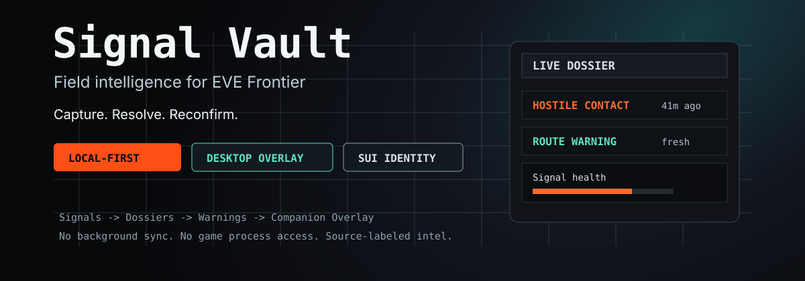
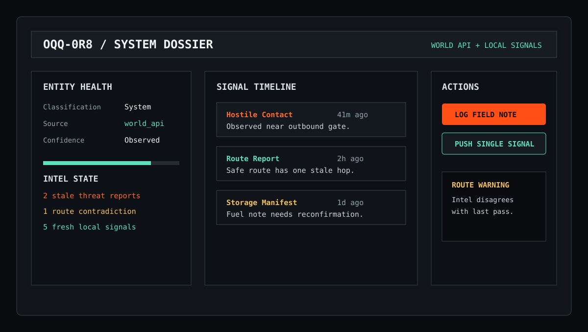
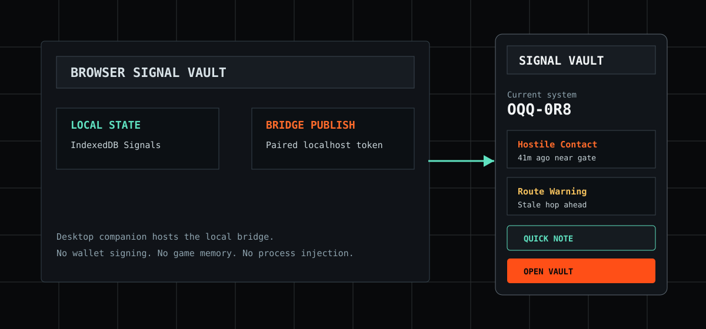

# Signal Vault



**Field intelligence for EVE Frontier.**

Signal Vault turns scattered observations into structured Signals: who saw it,
what object or system it belongs to, how confident the report is, how stale it
is, and what action a pilot should take next.

It is built for EVE Frontier's programmable world and Smart Assembly direction,
but it stays practical today: browser-first, local-first, and paired with a
Windows desktop companion overlay for in-play use.

[EVE Frontier builder docs](https://docs.evefrontier.com/) describe a
programmable world where in-game entities can be represented on-chain and
extended by builders. The EVE Frontier dApp Kit exposes Smart Object context for
supported dApp surfaces through `EveFrontierProvider`, `useConnection`, and
`useSmartObject`: [dApp Kit docs](https://sui-docs.evefrontier.com/).

## Why It Exists

EVE Frontier creates a new kind of intel problem. Gates, storage units, systems,
routes, tribes, markets, and field encounters all matter, but the useful context
is often split across memory, chat, browser tabs, screenshots, and stale notes.

Signal Vault gives that context a shape:

- **Capture fast:** log hostile contacts, route reports, market notes, access
  denials, storage manifests, and field notes.
- **Resolve what you saw:** connect Signals to systems, Smart Objects, tribes,
  routes, or unresolved objects without pretending hints are truth.
- **Know what changed:** stale intel, contradiction warnings, confidence labels,
  and official data enrichment make old reports safer to interpret.
- **Stay local by default:** data lives in your browser unless you choose to
  push a single Signal through the alpha remote path.
- **Use it while playing:** the desktop companion shows live state, warnings,
  quick notes, and current-system handoff without touching the game client.

## Product Surfaces



| Surface | What it is for | Status |
|---|---|---|
| Browser app | Full Signal log, dossiers, route context, import/export | Alpha-ready locally |
| In-game/object route | Smart Object context page for supported dApp surfaces | Implemented, defensive |
| Desktop companion | Windows overlay, tray, hotkey, local bridge, quick note | Packaged alpha |
| API backend | Optional remote push, audit log, Sui identity resolution | Alpha, production proof pending |



## What You Can Track

| Category | Signal types |
|---|---|
| Movement and access | Gate Recon, Route Report, Permit Report, Access Denied |
| Resources and trade | Storage Manifest, Market Report, Resource Report |
| Threat | Hostile Contact, After Action Report |
| General | Field Note, System Report, Assembly Log |

Every Signal carries an entity snapshot, author context, confidence, visibility,
and staleness behavior. Old records remain historical records; they are not
silently rewritten when a wallet or character context changes.

## Trust Boundaries

Signal Vault is deliberately conservative:

- **No background sync.** Remote push is manual and single-Signal.
- **No fake dApp browser.** The browser app uses official EVE Vault/dApp Kit
  paths only where supported.
- **No game memory reads or process injection.** The desktop companion is a
  local overlay and bridge, not a game-client automation layer.
- **No dev auth in production.** Release checks block production dev-auth flags.
- **No silent Smart Assembly inference.** URL params and World API data are
  hints; verified Smart Assembly context comes from supported EVE/dApp sources.

## Current Alpha State

Latest local release gate on this branch:

| Gate | Result |
|---|---|
| Web tests | 693 passed |
| API tests | 239 passed / 5 skipped |
| Script tests | 15 passed |
| Web build | Passing |
| Main bundle dApp Kit references | 0 |
| File-size guardrail | All files at or under 400 lines |

Remote production readiness is intentionally not overclaimed. The RLS verifier
and Railway deployment notes are in place, but the live deployed-role proof must
pass against the deployed Postgres database before public remote-write claims.

## Run It Locally

Prerequisites:

- Node `>=24`
- pnpm
- Rust toolchain only if running the desktop companion

```bash
pnpm install

# Browser app, local-first
pnpm dev

# API backend
pnpm dev:api

# Desktop companion
pnpm dev:desktop

# Release gate
pnpm check:release
```

Optional World API enrichment:

```bash
# apps/web/.env.local
VITE_WORLD_API_BASE_URL=https://world-api-stillness.live.tech.evefrontier.com
VITE_WORLD_API_ENV=stillness
```

Optional remote API:

```bash
# apps/api/.env
DATABASE_URL=postgres://...
ENABLE_REMOTE_SIGNAL_WRITES=false
AUTH_DEV_MODE=false
ENABLE_SUI_CHARACTER_RESOLUTION=false
SIGNAL_VAULT_ALLOWED_ORIGINS=http://localhost:5173
```

For Railway backend setup, see
[`docs/operations/12-railway-backend-deployment.md`](docs/operations/12-railway-backend-deployment.md).

## Repo Map

```txt
apps/web       React + Vite local-first app
apps/desktop   Tauri Windows companion overlay
apps/api       Hono + Postgres remote push backend
docs/          product, architecture, alpha, backend, operations
scripts/       release, static index, and policy checks
```

Start with:

- [`docs/README.md`](docs/README.md) - docs guide
- [`docs/alpha/00-alpha-guide.md`](docs/alpha/00-alpha-guide.md) - alpha player guide
- [`docs/operations/08-signal-vault-action-register.md`](docs/operations/08-signal-vault-action-register.md) - current action register
- [`docs/phases/phase-13a-desktop-overlay-feasibility.md`](docs/phases/phase-13a-desktop-overlay-feasibility.md) - desktop companion phase

## Build Philosophy

Signal Vault is not a generic notes app with space styling. It is a field intel
tool for a world where object identity, tribe context, player reports, stale
evidence, and on-chain state can disagree.

The rule is simple:

> Capture what was known at the time. Label the source. Reconfirm before acting.
